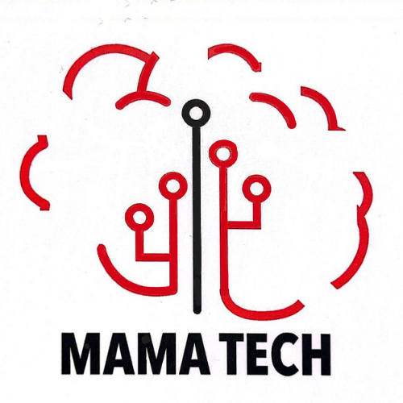

Here's a README.md file that incorporates all the provided information:

````markdown
# Mama Tech

 

## Empowering Women Through Technology

**Building solutions for social impact, by women, for women.**

### About Mama Tech

Mama Tech is a boutique, full-service development agency dedicated to creating technology solutions for social good, with a primary focus on empowering women and girls. Our team of skilled female technologists brings unique perspectives to each project, ensuring that every solution is both user-centered and impactful.

### Features include

#### About Section

This section introduces visitors to Mama Tech’s mission, values, and core purpose, establishing a connection with the audience and showcasing Mama Tech's focus on social good and women empowerment.

#### Services Section

This section provides a detailed overview of Mama Tech's services, explaining how each one contributes to the agency’s mission of social impact.

#### Contact Section

A user-friendly section that allows potential clients, collaborators, or mentees to get in touch with Mama Tech.

### Job Board

This section showcases available job opportunities at Mama Tech or on projects related to their mission of social impact and empowering women in technology.

---

## Setup Instructions

### Prerequisites

This project is built on Ruby on Rails. To get started, ensure you have Ruby and Rails installed.

### Install Dependencies

To install the necessary gems, run:

```bash
bundle install
```
````

### Gems Overview

- **Rails** - Web application framework
- **sprockets-rails** - Asset pipeline
- **sqlite3** - Database
- **puma** - Web server
- **importmap-rails** - JavaScript imports
- **turbo-rails** - SPA-like page acceleration
- **stimulus-rails** - JavaScript framework for interactions
- **cssbundling-rails** - CSS bundling and processing
- **jbuilder** - JSON API generation
- **mailtrap** - For email sending (configure with Mailtrap)

Additional gems for development and testing:

- **brakeman** - Static analysis for security
- **rubocop-rails-omakase** - Ruby code styling
- **web-console** - Debug console
- **capybara** and **selenium-webdriver** - System testing
- **dotenv-rails** - Environment variables

### Run the Server

To start the Rails server, use:

```bash
rails server
```

Visit `http://localhost:3000` to view the application.

---

### Development Notes

- **Debugging**: Uses `debug` gem for debugging capabilities.
- **Environment Variables**: Managed through `dotenv-rails` for secure configuration.
- **Security**: Brakeman gem is included for static analysis of security vulnerabilities.

---

## License

This project is licensed under the terms and conditions of Mama Tech. All rights reserved.

```

This README provides an introduction to Mama Tech, outlines the services and contact information, includes setup and gem instructions, and highlights tools used in development. Adjust any specific file paths or contact details as necessary for your setup.
```